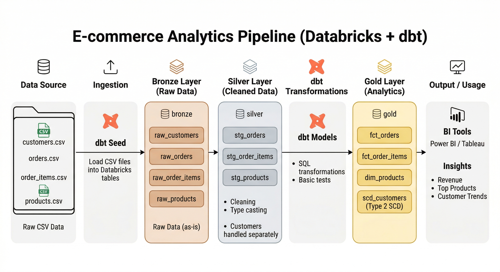

# 🛒 Building a Unified Analytics Layer for E-commerce using Medallion Architecture

> 🚀 End-to-end analytics pipeline using Databricks + dbt

---

## 🏗️ Architecture Overview

### 🔄 Data Flow

1. **Data Source**
   - Raw CSV files (customers, orders, products)

2. **Ingestion**
   - dbt seed loads data into Databricks

3. **Bronze Layer**
   - Raw tables (`raw_customers`, `raw_orders`, etc.)
   - No transformation

4. **Silver Layer**
   - Cleaned & validated data
   - (`stg_orders`, `stg_products`, etc.)

5. **dbt Transformations**
   - SQL models
   - Data quality tests

6. **Gold Layer**
   - Fact & Dimension tables
   - (`fct_orders`, `dim_products`, `scd_customers`)

7. **Output**
   - Power BI / Tableau dashboards
   - Business insights